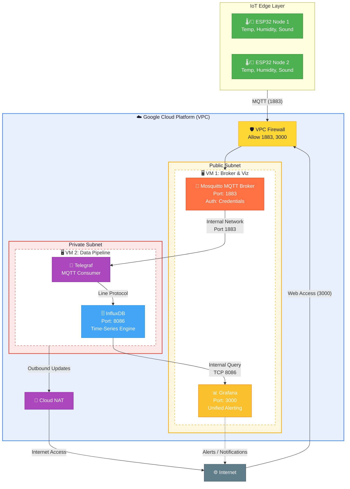

# IoT Environmental Monitoring System

## Description
The system consists of a network of IoT devices distributed in different zones of an event or space of coworking. Each device utilizes an ESP32 equipped with temperature, humidity, and a sound sensor (analog microphone) to capture the environmental conditions in real time.

## General Objective
Develop an intelligent and accessible monitoring system that collects and analyzes environmental and acoustic data from a physical space, allowing developers to consult comfort conditions and sensory accessibility through an AI Agent.

## Community Impact
Create a real-time thermal and acoustic map accessible from mobile devices, helping neurodivergent developers or those who require high-concentration spaces (such as in hackathons or conferences) to find their ideal workspace.

## System Architecture & Components

The architecture is distributed across the IoT edge (sensors), a messaging and broker layer, an ingestion and storage layer, and a visualization engine.



### Component Breakdown

* **IoT Layer (ESP32 Nodes):** Distributed edge devices collecting environmental and acoustic data. They stream data using lightweight JSON payloads over MQTT via the public IP of VM 1.
* **VM 1 (Public Subnet):**
    * **Mosquitto MQTT Broker:** The entry point for all IoT traffic, secured with authentication to prevent unauthorized data injection.
    * **Grafana:** The visualization hub, accessible via web, providing real-time dashboards and the Unified Alerting engine.
* **VM 2 (Private Subnet):**
    * **Telegraf:** Acting as the bridge; it subscribes to the broker using the GCP internal network, processes incoming telemetry, and writes it to InfluxDB.
    * **InfluxDB:** Securely stores time-series data. It is not exposed to the internet, accepting queries only from the internal VPC network.

---

## MQTT Broker Setup (Mosquitto)

The broker acts as a central hub that receives messages from the ESP32 nodes and distributes them to subscribers like Telegraf.

### 1. Installation
On your **VM 1** (Ubuntu), install the Mosquitto broker and the client tools to test connections:

```bash
sudo apt update
sudo apt install mosquitto mosquitto-clients -y
```


### 2. Configuration
To secure the broker and allow external connections from your ESP32 nodes, create a configuration file:

```bash
sudo nano /etc/mosquitto/conf.d/default.conf
```

Paste the following configuration:
```text
# Allow connections on the standard port
listener 1883 0.0.0.0

# Disable anonymous access for security
allow_anonymous false

# Path to the password file
password_file /etc/mosquitto/passwd
```

### 3. Security: Creating a User
Generate the password file and add a user (e.g., `esp32_device`). You will be prompted to enter a password:

```bash
sudo mosquitto_passwd -c /etc/mosquitto/passwd esp32_device
```

### 4. Permissions & Persistence
As we've seen before, ensuring the service has the right permissions is key to preventing start-up failures:

```bash
# Set ownership to the mosquitto user
sudo chown -R mosquitto:mosquitto /etc/mosquitto
sudo chmod 0600 /etc/mosquitto/passwd

# Enable and restart the service
sudo systemctl restart mosquitto
sudo systemctl enable mosquitto
```

### 5. Verification
Check if the broker is running correctly:
```bash
sudo systemctl status mosquitto
```

> **Note on Connectivity:** Since this VM is on a **GCP Public Subnet**, ensure that you have configured the **VPC Firewall rules** in the Google Cloud Console to allow inbound traffic on **TCP port 1883**.


---

## Data Pipeline Setup (Telegraf)

**Telegraf** is a server-based agent for collecting and sending metrics. In this architecture, it acts as an **MQTT Consumer**, subscribing to specific topics on the broker and writing that data into **InfluxDB**.

### 1. Installation
On **VM 2** (Private Subnet), install Telegraf. Since it's a private subnet, ensure the VM has access to the internet (via Cloud NAT) to download the package:

```bash
# Add InfluxData repository
curl -s https://repos.influxdata.com/influxdata-archive_compat.key | sudo apt-key add -
echo "deb https://repos.influxdata.com/ubuntu $(lsb_release -cs) stable" | sudo tee /etc/apt/sources.list.d/influxdb.list

# Install Telegraf
sudo apt update && sudo apt install telegraf -y
```

### 2. Configuration
The configuration is handled via a single file. We will configure the input (MQTT) and the output (InfluxDB).

Edit the configuration file:
```bash
sudo nano /etc/telegraf/telegraf.conf
or
sudo nano /etc/telegraf/telegraf.d/mqtt_to_influx.conf
```

#### A. Output Configuration (InfluxDB)
Search for the `[[outputs.influxdb]]` section and update it:
```text
[[outputs.influxdb]]
  urls = ["http://127.0.0.1:8086"]
  database = "sensors_data"
  # If you set up authentication in InfluxDB, add it here:
  # username = "telegraf_user"
  # password = "your_password"
```

#### B. Input Configuration (MQTT Consumer)
Search for the `[[inputs.mqtt_consumer]]` section:
```text
[[inputs.mqtt_consumer]]
  # Internal IP of VM 1 (Broker)
  servers = ["tcp://INTERNAL_IP_VM1:1883"]
  
  # Topics to subscribe to
  topics = [
    "room1/sensors",
  ]
  
  # MQTT Credentials
  username = "esp32_device"
  password = "your_mqtt_password"
  
  # Data format
  data_format = "json"
```

### 3. Service Management
Apply the changes and ensure Telegraf starts automatically on every boot:

```bash
# Start and enable the service
sudo systemctl restart telegraf
sudo systemctl enable telegraf

# Check logs to ensure it's connecting to the broker
sudo journalctl -u telegraf -f
```

---

### Why this setup?
* **Security:** Telegraf connects to the Broker using the **Internal VPC Network**. This means the MQTT traffic between the broker and the consumer never leaves Google's private network.
* **Efficiency:** The JSON format is parsed automatically by Telegraf, converting complex payloads into InfluxDB Line Protocol without extra code.

---

## Storage Layer Setup (InfluxDB)

**InfluxDB** is an open-source time-series database (TSDB) optimized for fast, high-availability storage and retrieval of time-stamped data. Unlike traditional SQL databases, it is designed to handle the high write loads generated by IoT sensors.

### 1. Installation
On **VM 2** (Private Subnet), since the InfluxData repository was added during the Telegraf step, you can install it directly:

```bash
sudo apt update
sudo apt install influxdb -y
```

### 2. Service Management
Ensure the database starts automatically whenever the VM is rebooted:

```bash
sudo systemctl start influxdb
sudo systemctl enable influxdb
```

### 3. Database Configuration
By default, InfluxDB (1.8.x) listens on port **8086**. We need to create the specific database that Telegraf is expecting to use.

Access the InfluxDB CLI:
```bash
influx
```

Inside the Influx shell, run the following commands:
```sql
-- Create the database
CREATE DATABASE sensors_data

-- Verify it was created
SHOW DATABASES

-- Exit the shell
EXIT
```

### 4. Data Retention (Optional but Recommended)
To prevent the VM from running out of disk space over time, you can set a **Retention Policy**. For example, to keep data only for 30 days:

```sql
CREATE RETENTION POLICY "30_days_retention" ON "sensors_data" DURATION 30d REPLICATION 1 DEFAULT
```

### 5. Verification
Once your ESP32 is running and Telegraf is active, you can verify that data is actually being stored by running:

```bash
influx -database 'sensors_data' -execute 'SELECT * FROM readings_sensors LIMIT 10'
```


---

### Security Note
Since InfluxDB is in the **Private Subnet**, it is not accessible from the public internet. It only accepts connections from **VM 1** (for Grafana queries) and local connections from Telegraf, making it highly secure.

---

## Visualization & Alerting (Grafana)

**Grafana** is an open-source analytics and interactive visualization web application. It connects to your data sources, provides charts, graphs, and alerts for your web browser when connected to your time-series database.

### 1. Installation
On **VM 1** (Public Subnet), install Grafana to allow web access:

```bash
# Install dependencies
sudo apt-get install -y apt-transport-https software-properties-common wget

# Add the Grafana GPG key and repository
sudo wget -q -O /usr/share/keyrings/grafana.gpg https://apt.grafana.com/gpg.key
echo "deb [signed-by=/usr/share/keyrings/grafana.gpg] https://apt.grafana.com/oss/deb stable main" | sudo tee /etc/apt/sources.list.d/grafana.list

# Install Grafana
sudo apt-get update && sudo apt-get install grafana -y
```


### 2. Service Management
Ensure Grafana starts automatically on boot:

```bash
sudo systemctl start grafana-server
sudo systemctl enable grafana-server
```

### 3. Accessing the Dashboard
* **URL:** `http://YOUR_VM1_PUBLIC_IP:3000`
* **Default Credentials:** User: `admin` / Password: `admin` (You will be prompted to change it immediately).

> **Important:** Ensure the **VPC Firewall** allows inbound traffic on **Port 3000**.


-----


### 4. Connecting InfluxDB as a Data Source
Inside the Grafana UI:
1. Go to **Connections** > **Data sources** > **Add data source**.
2. Select **InfluxDB**.
3. **URL:** `http://INTERNAL_IP_VM2:8086` (Communication stays within the private VPC).
4. **Database:** `sensors_data`.
5. Click **Save & test**.

### 5. Configured Monitoring Alerts
This project implements three types of proactive notifications:

1.  **Threshold (Static):** Triggers if the temperature exceeds **30°C** for more than 5 minutes.
2.  **Range (Environmental Comfort):** Triggers if the humidity falls outside the **40% - 60%** range, indicating a poor environment for concentration.
3.  **Absence (Heartbeat):** Crucial for IoT. Triggers if no data is received from the ESP32 for over **10 minutes**, notifying that the sensor is offline.


----


---

### Notification Channels (Contact Points)
Alerts are configured to be sent via:
* **Email:** Configured via SMTP (Gmail App Password).
* **Telegram:** (Optional) Real-time push notifications via a custom Bot.

---

## Hardware & Simulation (Wokwi / Arduino)

The "edge" of this system is powered by the **ESP32**, a powerful microcontroller with integrated Wi-Fi. In this project, it acts as a telemetry producer, sampling sensors and pushing structured data to the cloud.

### 1. Hardware Components
To replicate the physical setup, the following components are used:
* **MCU:** ESP32 (NodeMCU or similar).
* **Environment Sensor:** DHT22 (High-accuracy temperature and humidity).
* **Acoustic Sensor:** Analog Microphone (MAX9814 or similar) connected to an Analog-to-Digital Converter (ADC) pin.
* **Connectivity:** 2.4GHz Wi-Fi.

### 2. Simulation Environment (Wokwi)
The firmware is developed and tested using **Wokwi**, an online electronics simulator. This allows for:
* **Rapid Prototyping:** Testing the MQTT connection logic without hardware.
* **Virtual Debugging:** Using the serial monitor to verify JSON payload structures before they hit the broker.
* **Network Simulation:** Wokwi provides a "Wokwi-GUEST" Wi-Fi gateway to simulate real internet connectivity.

### 3. Firmware Logic Overview
The ESP32 runs a C++ (Arduino) sketch based on the following functional blocks:

* **Network Management:** Connects to Wi-Fi and maintains a persistent connection to the MQTT Broker on **VM 1**.
* **Modularity (Secret Management):** Sensitive credentials (Wi-Fi SSID, MQTT user/pass, and Broker IP) are kept in a separate `secrets.h` file to maintain security and code cleanliness.
* **Data Acquisition:** * Samples the DHT22 every few seconds.
    * Calculates the peak-to-peak amplitude or average sound levels from the analog microphone.
* **Payload Construction:** Encapsulates the readings into a **JSON string** to ensure compatibility with the Telegraf parser.
* **Transmission:** Publishes the payload to the `room1/sensors` topic.

### 4. Pro-Tip: Hardware Deployment
When moving from Wokwi to a physical ESP32, ensure you:
1.  **Check Voltages:** The DHT22 and many microphones work best at 3.3V on the ESP32.
2.  **Install Libraries:** Use the `PubSubClient` for MQTT and `ArduinoJson` for efficient payload handling.
3.  **Secure the Broker:** Update your `secrets.h` with the public IP of your VM 1 and the specific credentials created during the Mosquitto setup.

---


---

## Author

* **Juan Guillermo Gómez**
* Linkedin: [@jggomezt](https://www.linkedin.com/in/jggomezt/)


